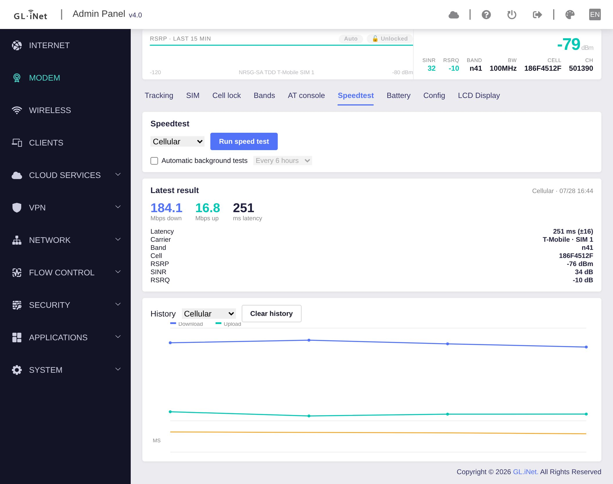
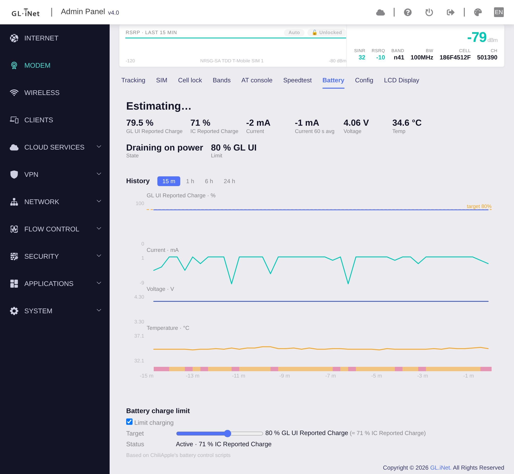

# MudiModem

I have the Mudi 7 which is an amazing device.  I felt that it has good modem controls, but they were spread around.  I also felt it could have better signal and event tracking.   I spent a couple of weeks vibe coding a new modem control panel that brings all things modem into one section of the built in UI.

MudiModem uses GL's built in modem commands to accomplish what it does so should not conflict with settings made through the native UI.


---

## Features

MudiModem is a tabbed page. Every screen anchors to a persistent **live signal strip** across the top
(RSRP, updating in real time) so you can always see what a change did to the connection. The tabs
documented below are Tracking, Bands, Cell lock, AT console, SIM, Speedtest and Battery; there is
also a Config tab (version / self-update). Everything live on the page is pushed by the router
(GL's websocket bus) — the page never polls.

### 📈 Tracking


Watch the radio over time. RSRP, SINR, and RSRQ share one time axis so you can see them move together,
with lanes below showing exactly when the **band**, **cell**, or **SIM** changed — and an **event log**
that records every change with a timestamp and who caused it (*you*, the *network*, or the safety
watchdog). Pick a window from 15 minutes to 24 hours. Two badges on the signal strip show at a glance
whether a **mode lock** (Auto / 4G-only / 5G-only) or a **tower lock** is in force; click either to jump
to its tab.

### 📶 Bands


Choose which cellular bands the modem may use. Each band is colored for its **real** state — *active*,
*permitted but not selected*, or **blocked by carrier policy** (shown and explained, but not selectable,
because the modem will never use it ). A network-mode selector (Auto /
5G only / 4G only) sits on top.

Band changes are **confirm-or-revert**: applying one starts a ~60-second countdown and automatically
rolls back unless you confirm you want to keep it — so a bad lock can't strand the cellular link you're
administering over.

### 🔒 Cell lock


Pin the modem to a specific cell so it won't hand over. The tab shows your current serving cell and can
**scan for nearby lockable cells**, listed with your **serving carrier's cells first** and **5G above
LTE**, each with a one-click Lock. Same confirm-or-revert safety as Bands.

⚠️ A kept cell lock lives in the modem's own memory and survives reboot, reflash, *and* factory reset 

### ⌨️ AT console


A raw AT terminal to the modem, on its **own** channel so it doesn't collide with GL's polling. Alongside
it, a searchable **community command library** where every entry carries a **risk badge** — `read` (query
only), `set` (runtime, gone on reboot), or `nv` (**writes permanent memory; survives factory reset**).
Nothing ever runs by itself: clicking a library entry just fills the prompt, and `set`/`nv` commands stay
locked until you tick "enable higher-risk commands."

### 🚀 Speedtest



The Mudi has no built-in speed test. This one runs download, upload and latency against Cloudflare's
public endpoints over the box's own uplink — no server to run, nothing to install. Hit **Run speed
test** and the phase text walks you through it (*Testing download… → upload… → latency…*); results
land in a **Latest result** panel with the three headline numbers, then in a history graph below —
download and upload sharing one Mbps axis, latency in a thin lane underneath. Hover any point for the
full detail.

The thing that makes it more than a speed test: **every stored result carries a snapshot of what the
radio was doing at that moment** — carrier, SIM slot, band, cell ID, RSRP, SINR and RSRQ. So a dip in
throughput isn't just a slow number, it's a slow number you can attribute to a band change, a
handover, or a weak cell.

Pick which uplink to test — **Cellular** or **Wired WAN** — and the dropdown marks one *(not
connected)* rather than letting you start a test doomed to fail. The history graph has its own
interface filter, because wired and cellular differ by enough that plotting them together would flatten
the cellular trend into a line along the bottom.

Optional **automatic background tests** on a 30 m – 24 h interval build the history while you're not
looking; **off by default**, because each test spends about 22 MiB of your data plan. Results are
capped at the last 500 and stored in `/etc/mudimodem`, so unlike the RF history they **survive a
reboot**.

### 🔋 Battery



The Mudi runs on a battery, and the stock UI shows you a single percentage. This tab records the
battery every 20 seconds and plots the last **24 hours** as **four stacked lanes on one time axis** —
charge %, current (mA), voltage (V) and temperature (°C). They are deliberately *not* normalized onto
a shared scale: each lane keeps its real units, because the number that matters most is when current
hits exactly **zero**, and normalizing would turn zero into "low". Pick a window of 15 m / 1 h / 6 h /
24 h, and hover anywhere to read every lane at that instant. Shading behind the chart marks what the
battery was actually doing — *Charging*, *On battery*, *Full*, *Charge blocked (limit)*, *Draining on
power* — and ticks mark each plug and unplug.

Above the chart, a headline estimate — **"3 h 20 m remaining"** or **"1 h 5 m to 80 %"** — fitted from
the recent trend, with the span it was fitted over shown beside it so you can judge it. It refuses to
print a number it can't defend, and while the charge limiter is holding the pack it says **"Holding at
80 %"** rather than inventing a time-to-empty the device is designed to falsify.

The tab also carries the **charge limit** control: cap charging at a target percentage to spare the
cell from sitting at 100 % on permanent mains power. Set the target with a slider and the card reports
whether the limit is *Off*, *Armed* (will apply when the charger connects), or *Active*.

⚠️ Two charge scales exist on this box and they disagree by about 9 points, so every figure is labelled
with which one it is: **GL UI Reported Charge** (what GL's admin and the front panel show) and **IC
Reported Charge** (the raw fuel-gauge reading, which is what the limiter actually enforces against).

The charge-limit stack is based on **[ChiliApple](https://github.com/ChiliApple)'s battery control scripts**

---

## Installing it

From a **root shell on the router** 

```sh
curl -fsSL https://raw.githubusercontent.com/Antiman-cmyk/MudiModem/main/install.sh | sh
```

The installer downloads every file from GitHub, gzips the page chunks with the box's own `gzip`, and drops
them into place — no toolchain, nothing to build. Then **reload the GL admin in your browser** and a
**MODEM** item appears in the top navigation. There's no reboot. It refuses firmware older than 4.10.

**Installing from a fork or branch** (e.g. before a change is merged upstream): point the installer at
that tree's raw URL. The source is recorded on the box, so the Config tab's update check and
**Update now** keep following the same fork/branch instead of upstream:

```sh
B=https://raw.githubusercontent.com/<user>/MudiModem/<branch>
curl -fsSL "$B/install.sh" | MUDIMODEM_BASE="$B" sh
```

**Uninstall** is the mirror image:

```sh
curl -fsSL https://raw.githubusercontent.com/Antiman-cmyk/MudiModem/main/uninstall.sh | sh
```

Both scripts **refuse to run against anything that isn't a GL-E5800** on firmware 4.10 or newer.
(This tree's default source is `Antiman-cmyk/MudiModem`; the original project by kevinherzig is the
1.x / firmware-4.8 line.)

> **Heads up — it's a travel router on cellular.** If you administer the Mudi *over* its own cellular
> link, a bad band or cell lock can drop the connection you're using. MudiModem's confirm-or-revert
> watchdog is built for exactly this, and the panel documents an ssh panic-restore for the worst case —
> but treat band/lock changes with care when you're remote.

## Hardware / compatibility

- **Router:** GL.iNet GL-E5800 ("Mudi"), **GL firmware 4.10.x** / OpenWrt 23.05.4
- **Modem:** Quectel **RG650V** (NA and EU variants; band tables cover both)

| MudiModem | GL firmware | notes |
|---|---|---|
| **2.x** (this branch) | **4.10 and later** | built on 4.10's per-slot band API, merged websocket state and `cell_info`; the installer refuses older firmware |
| 1.x (`legacy-4.8` tag) | 4.8.x | `MUDIMODEM_REF=legacy-4.8 sh install.sh` |

The firmware contract 2.x relies on is documented in `docs/cellular-api-4.10.md`. The band model
and AT commands are Quectel- and firmware-specific; treat other hardware as untested.
